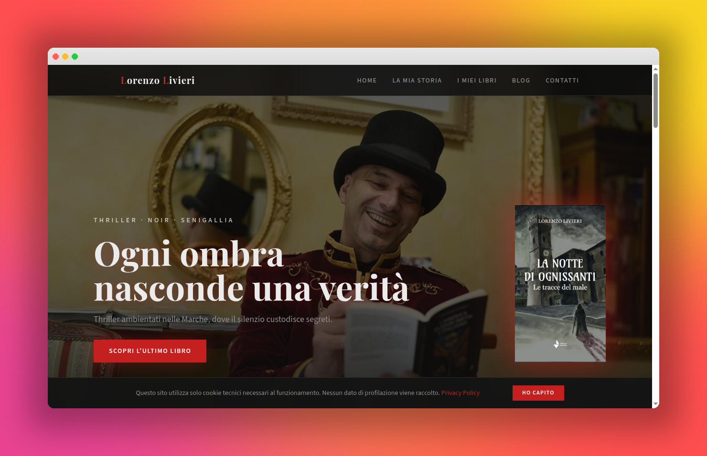

# Lorenzo Livieri — Author Website

A fast, dark, mobile first website for Italian thriller author Lorenzo Livieri.
Built as a single page React app with a strong focus on typography, atmosphere
and SEO.

🔗 **Live site:** [lorenzolivieri.vercel.app](https://lorenzolivieri.vercel.app)



---

## What this project is

A real, in production author portfolio. The goal was simple: give readers a
site that feels like the books. Dark, cinematic, a bit noir, with crimson
accents and elegant serif headings. No clutter, no tracking, no fake CTAs.

It is a static SPA, so it loads fast, ranks well on Google and costs nothing
to host.

---

## Tech stack

| Area         | Tools                                              |
|--------------|----------------------------------------------------|
| Framework    | React 18, Vite 5, TypeScript 5                     |
| Styling      | Tailwind CSS, semantic design tokens (HSL)         |
| UI           | shadcn/ui, Radix primitives, Lucide icons          |
| Routing      | React Router                                       |
| Data layer   | TanStack Query                                     |
| Forms        | React Hook Form, Zod                               |
| Testing      | Vitest, Testing Library                            |
| Hosting      | Vercel (SPA with rewrites)                         |

---

## Things I am proud of

**Design system from scratch.** Every color, shadow and gradient lives in
`index.css` and `tailwind.config.ts` as HSL semantic tokens. No hardcoded
colors anywhere in components, so the whole theme can be retuned in one file.

**Mobile first, really.** Books section uses dedicated image crops below the
`sm` breakpoint, font sizes scale per viewport, touch targets are generous.
The site was designed on a phone first, then on desktop.

**SEO done properly.**
- Single H1 per page, semantic HTML
- Multiple JSON-LD blocks (`WebSite`, `Person`, `Book` graph for every novel)
- Meta tags tuned for the target Italian keywords
- Canonical URLs, sitemap, robots.txt
- Optimized images, lazy loading where it matters
- Verified on Google Search Console

**GDPR without the noise.** Technical only cookie banner, zero tracking
scripts, no analytics that need consent. Privacy page included.

**Italian legal compliance.** Footer shows P.IVA and Registro Imprese as
required for Italian professional websites.

**Smooth UX details.** Horizontal scroll for the books shelf, hover states
on covers, sticky nav, smooth section anchoring, custom 404 page.

---

## How AI fits in

This project was built with an AI native workflow using
[Lovable](https://lovable.dev). What that means in practice:

- I drove the product decisions (structure, tone, UX, SEO strategy, what to
  cut) and used AI to translate them into code fast.
- Every prompt was specific and reviewed. AI generated code was read,
  refactored and tested, not blindly accepted.
- The design system, the SEO setup and the Italian compliance details were
  iterated through tight feedback loops with the AI.
- Project memory was used to lock in design rules (colors, typography, layout
  order, no blog, no social links) so the AI stayed consistent across
  sessions.

The result is a production site that took days instead of weeks, without
giving up on code quality or design taste.

---

## Run it locally

You need Node.js 18 or newer.

```sh
git clone https://github.com/<your-username>/<your-repo>.git
cd <your-repo>
npm install
npm run dev
```

Other scripts:

```sh
npm run build      # production build
npm run preview    # preview the build
npm run lint       # eslint
npm run test       # vitest
```

---

## Project structure

```
src/
├── components/        # Section components (Hero, Books, Author, etc.) + shadcn ui
├── pages/             # Index, Privacy, NotFound
├── hooks/             # Custom hooks
├── lib/               # Utilities
└── index.css          # Design tokens (HSL semantic colors)

public/                # Favicon, sitemap, robots, Google verification
```

---

## License

MIT. See [LICENSE](./LICENSE).
